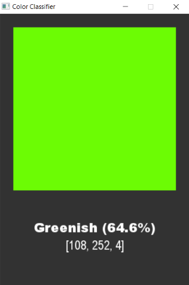

[ARCHIVE PROJECT - 2020]

# COLOR CLASSIFIER 🔴🔵🟢
## Author: Konrad Ceglarski

### Description: Model uczenia maszynowego klasyfikujący kolory na podstawie przygotowanych danych.

### Notes:
Jest to prosty klasyfikator kolorów oparty na nauczaniu maszynowym (ML), stworzony z biblioteką **sklearn** oraz **pygame** nadającą interfejs graficzny (GUI). \
Jest to również mój pierwszy program wykorzystujący technologię ML. \
Na potrzeby programu stworzyłem także prosty i mały interfejs wiersza poleceń (CLI), oferujący 5 komend. \
Poprzez wcześniej wspomniane CLI użytkownik może zmienić język programu głównego lub dać mu kolor do nazwania. \
Wbudowana jest takża mała gra, a mianowicie rzut monetą, w której losowane jest 0 lub 1. \
Użyj polecenia `help`, by poznać resztę dostępnych poleceń.

### Preview:
